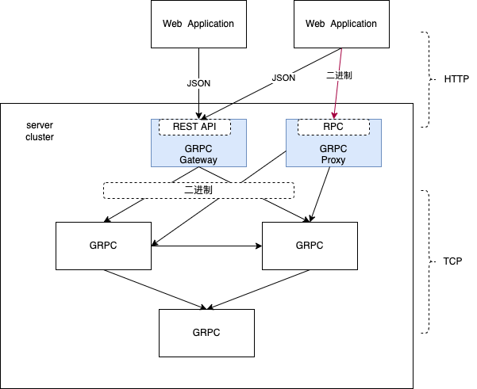

## a micro go gateway service

### Model


### Installation and Set-up:
#### install protobuf compiler:

download latest Protocol Buffers or which version you need.<br/>
link: https://github.com/protocolbuffers/protobuf/releases
##### set-up:
proto_buf version: protoc-21.10-osx-x86_64.zip

1. cp protoc-21.10-osx-x86_64.zip to you local path  /usr/local/{YourPathName}
```bash
>> tar -xzvf protoc-21.10-osx-x86_64.zip
```
2. open bash_profile and edit
```bash
>> vim ~/.bash_profile

export PROTOBUF=/usr/local/{YourPathName}
export PATH=$PATH:$PROTOBUF/bin
```

3. source
```bash
>> source ~/.bash_profile
```

4. it's ok

```bash
>> protoc --version
libprotoc 3.21.10
```

#### install go protobuf plugin
link: https://github.com/grpc-ecosystem/grpc-gateway

### How to run:
#### RPC
cd dir to micro-gogrpc-gateway
```bash
>> go run main.go
>> cd client
>> go run main.go
```
you will see the response in the terminal

#### HTTP

open browser and tap localhost:8080/tarce/{id}, you will see:
```json
// http://localhost:8080/trace/123

{
  "id": "123",
  "trace": {
    "time": "1670424996",
    "location": "shanghai",
    "staySec": "100",
    "vieePage": "hompage"
  }
}
```